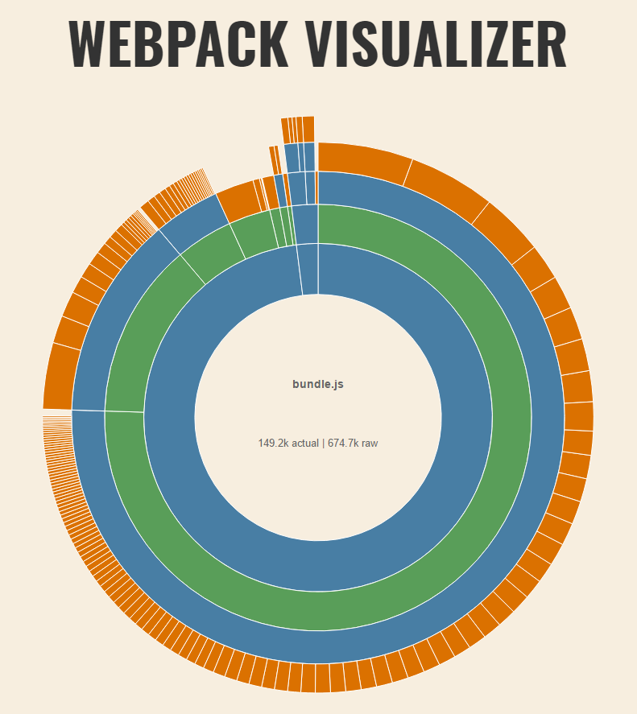
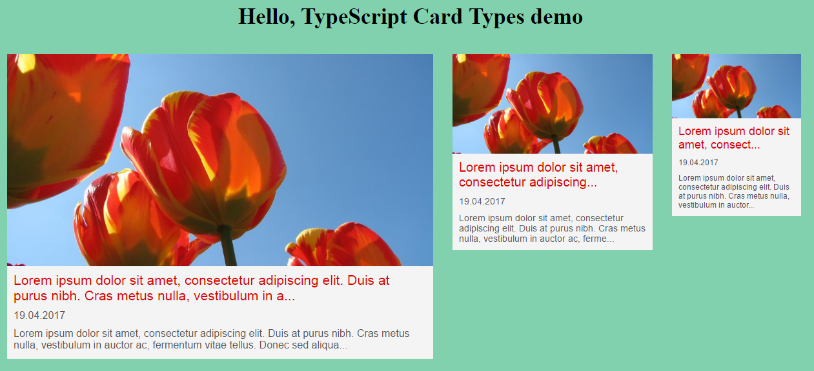

# Simple Starter Template for React, TypeScript, postCSS, ITCSS, CSS-Modules, Webpack 2 and Live Reloading (React Hot Loader 3)
Use this Starter template to create quickly first scaffolding for your SPA project.
If you like to don't forget to ★ on Github.

## Features
- [React](https://facebook.github.io/react)
- [TypeScript](https://www.typescriptlang.org) (compiling directly to ES5)
  - Using [@types instead of TSD or typings folder](https://github.com/jquintozamora/react-typescript-webpack2-cssModules-postCSS/blob/master/tsconfig.json#L14)
- [Hot Module Replacement](https://medium.com/@dan_abramov/hot-reloading-in-react-1140438583bf#.xh6v0ht7j) ([React Hot Loader 3](https://github.com/gaearon/react-hot-loader/issues/243))
- [Webpack 2](https://webpack.js.org)
    - [Webpack-dev-server](https://webpack.js.org/configuration/dev-server/)
    - [Webpack configuration for HMR](https://webpack.js.org/concepts/hot-module-replacement/)
    - Webpack production configuration
         - Split out css files using [ExtractTextPlugin](https://webpack.js.org/plugins/extract-text-webpack-plugin)
         - [UglifyJsPlugin with options](https://github.com/webpack/webpack/blob/v2.4.1/lib/optimize/UglifyJsPlugin.js)
         - Use include in the loader instead of the exclude. [More info](http://stackoverflow.com/questions/37823764/how-include-and-exclude-works-in-webpack-loader)
         - More perfomance tips: [here](https://medium.com/@khanght/optimize-webpack-production-build-ec594242b222#.bj3eyg65p)
    - [Webpack stats](https://github.com/jquintozamora/react-typescript-webpack2-cssModules-postCSS/blob/master/webpack/webpack.config.stats.js) (bundle optimization helper)
        - Generate stats.json file with profiler. Use (this tool)[http://webpack.github.io/analyse/] to analyze it.
        - [webpack visualizer](https://chrisbateman.github.io/webpack-visualizer/)
- [EditorConfig](http://editorconfig.org/)
- Styling
  - General Styling (app/stylesheets):
      - To include variables, generic CSS, normalize, reset, type selectors, ...
      - Methodology: [ITCSS](http://itcss.io)
      - Tools: [postCSS](http://postcss.org) with [import](https://github.com/postcss/postcss-import), [nesting](https://www.npmjs.com/package/postcss-nesting), [custom properties](https://github.com/postcss/postcss-custom-properties) and [autoprefixer](https://github.com/postcss/autoprefixer).
  - Components Styling (app/src/components/...):
      - To be the module's CSS
      - Techniques: [CSS Modules](https://github.com/css-modules/css-modules) + [postCSS](http://postcss.org) ([import](https://github.com/postcss/postcss-import), [nesting](https://www.npmjs.com/package/postcss-nesting), [custom properties](https://github.com/postcss/postcss-custom-properties) and [autoprefixer](https://github.com/postcss/autoprefixer)).
- Linting
  - TypeScript:
    - [TSLint](https://palantir.github.io/tslint): general rules + [react rules](https://github.com/palantir/tslint-react)
    - [VS Code TSLint extension](https://marketplace.visualstudio.com/items?itemName=eg2.tslint)
  - Styles
    - [Stylint](https://stylelint.io): CSS rules
      - Rules are on .stylelintrc.json
      - [All the rules](https://stylelint.io/user-guide/rules)
    - Install VS Code extensions:
        - [stylelint](https://marketplace.visualstudio.com/items?itemName=shinnn.stylelint)
        - [stylefmt](https://marketplace.visualstudio.com/items?itemName=mrmlnc.vscode-stylefmt)
          - Shift + Alt + F (Format Code)
          - Be sure you have these configurations on your .vscode/settings.json:
              - "css.validate": false,
              - "stylelint.enable": true


## Getting Started
### Install pre-requisites
- Node.js and NPM: [Download and install](https://nodejs.org/). *I have version 6.6.0 of Node and 3.10.6 of NPM on Windows PC*
- Git: [Download and install](https://git-scm.com/). *I have version 2.7.4 installed on Windows PC*

### Clone Repo
1. Get the url of your forked project.
    - Go to https://github.com/username/react-typescript-webpack2-cssModules-postCSS
2. Click on **"Clone or download"** and Copy to clipboard the url ending on .git.
3. Open your command line and go to your directoy
*You don't need to create a specific folder for the project, it will be created by git*
4. Clone your forked repo on your machine:
```
$ git clone https://github.com/username/react-typescript-webpack2-cssModules-postCSS
```
*Note: That will create a new folder called react-typescript-webpack2-cssModules-postCSS with all the files in.*


### Install Project dependencies
```
$ cd react-es6-webpack-minimal-starter-template
$ npm install
```


### Open the project with your Development IDE
I use VS Code https://code.visualstudio.com
Open the project using this command:
```
$ code .
```

### Start development server with Hot Reloading
```
$ npm run start
```

### Build for production
```
$ npm run build
```

### Generate Stats (it stores the html file with the stats under webpack/stats folder)
```
$ npm run stats
```
You will see the stats:
<br />


### Enjoy!

## Useful demo
As part of the boilerplate, you will see a fancy demo app with two react components already created:
- Viewer
  - [Stateless component](https://github.com/jquintozamora/react-typescript-webpack2-cssModules-postCSS/blob/master/app/src/components/Viewer/Viewer.tsx) (no state)
  - Use [CSS-Modules](https://github.com/jquintozamora/react-typescript-webpack2-cssModules-postCSS/blob/master/app/src/components/Viewer/Viewer.module.css)
- ViewerItem
  - Create [3 types of Item Card object](https://github.com/jquintozamora/react-typescript-webpack2-cssModules-postCSS/blob/master/app/src/components/ViewerItem/ViewerItemCardType.ts) (singleton, factory static)
  - Use [inline css using a function to assign CSS depending on the object](https://github.com/jquintozamora/react-typescript-webpack2-cssModules-postCSS/blob/master/app/src/components/ViewerItem/ViewerItem.inlined.css.ts)
  - Render [Table layout compatible with emails](https://github.com/jquintozamora/react-typescript-webpack2-cssModules-postCSS/blob/master/app/src/components/ViewerItem/ViewerItem.tsx)




## License
BSD 3-Clause License

Copyright (c) 2017, [José Quinto](https://blog.josequinto.com)
All rights reserved.

Redistribution and use in source and binary forms, with or without
modification, are permitted provided that the following conditions are met:

* Redistributions of source code must retain the above copyright notice, this
  list of conditions and the following disclaimer.

* Redistributions in binary form must reproduce the above copyright notice,
  this list of conditions and the following disclaimer in the documentation
  and/or other materials provided with the distribution.

* Neither the name of the copyright holder nor the names of its
  contributors may be used to endorse or promote products derived from
  this software without specific prior written permission.

THIS SOFTWARE IS PROVIDED BY THE COPYRIGHT HOLDERS AND CONTRIBUTORS "AS IS"
AND ANY EXPRESS OR IMPLIED WARRANTIES, INCLUDING, BUT NOT LIMITED TO, THE
IMPLIED WARRANTIES OF MERCHANTABILITY AND FITNESS FOR A PARTICULAR PURPOSE ARE
DISCLAIMED. IN NO EVENT SHALL THE COPYRIGHT HOLDER OR CONTRIBUTORS BE LIABLE
FOR ANY DIRECT, INDIRECT, INCIDENTAL, SPECIAL, EXEMPLARY, OR CONSEQUENTIAL
DAMAGES (INCLUDING, BUT NOT LIMITED TO, PROCUREMENT OF SUBSTITUTE GOODS OR
SERVICES; LOSS OF USE, DATA, OR PROFITS; OR BUSINESS INTERRUPTION) HOWEVER
CAUSED AND ON ANY THEORY OF LIABILITY, WHETHER IN CONTRACT, STRICT LIABILITY,
OR TORT (INCLUDING NEGLIGENCE OR OTHERWISE) ARISING IN ANY WAY OUT OF THE USE
OF THIS SOFTWARE, EVEN IF ADVISED OF THE POSSIBILITY OF SUCH DAMAGE.
